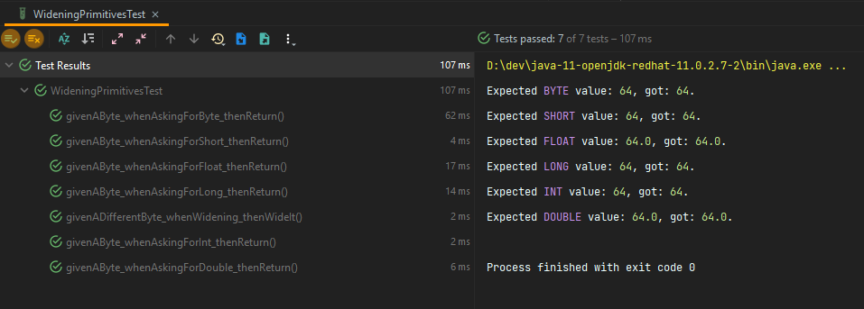
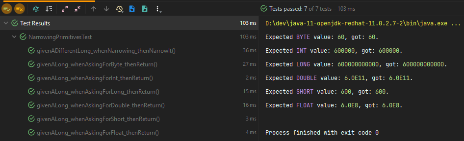

# Widening and Narrowing Primitive Types

In this exercise we'll be practicing both **widening** (implicit conversion) and **narrowing**
(explicit conversion).

---

## Widening

### WideningPrimitives.class

This is our class for practicing widening. The class has a constructor that receives a
**short** - the smallest number value in Java - and will be featuring a number of methods that
return another type of number. The returned number type will be one that accommodates a larger
number of bytes - thus no explicit cast should be needed.

The methods are:

```java
//simply return our number as a byte
public byte getSmallNumber(){
    ...
    }

//simply return our number as a short
public short toShort(){
    ...
    }

//simply return our number as an int
public int toInt(){
    ...
    }

//simply return our number as a long
public long toLong(){
    ...
    }

//simply return our number as a float
public float toFloat(){
    ...
    }

//simply return our number as a double
public double toDouble(){
    ...
    }
```

You are to implement these methods, and for each of them, you should return the
**smallNumber** - the **byte** value you received on the constructor.

### WideningPrimitivesTest.class

Once done, run the tests in **WideningPrimitivesTest** and make sure all of them are passing.

If everything is working correctly, then you should get an output similar to:



---

## Narrowing

### NarrowingPrimitives.class

Similar to the **WideningPrimitives**, the **NarrowingPrimitives** is our counterpart class to put
our narrowing skills into place.

The class has a constructor that receives a **long** - the biggest primitive number value in Java -
and will be featuring a number of methods that return another type of number. The returned number
type will be one that accommodates a smaller number of bytes - thus an explicit cast should be
needed for most cases.

On top of that, the returned values for our tests to pass should be values that actually fit into
the given number of bytes. We'll be dividing our **bigNumber** variable - the one you receive in the
constructor - by a given amount before returning it to the test class.

The methods are:

```java
//simply return our number as a long
public long getBigNumber(){
    ...
    }

//simply return our number as a double
public double toDouble(){
    ...
    }

//divide our number by 1_000 and return it as a float
public float toFloat(){
    ...
    }

//divide our number by 1_000_000 and return it as an int
public int toInt(){
    ...
    }

//divide our number by 1_000_000_000 and return it as a short
public short toShort(){
    ...
    }

//divide our number by 10_000_000_000L and return it as a byte
public byte toByte(){
    ...
    }
```

### NarrowingPrimitivesTest.class

Once done, run the tests in **NarrowingPrimitivesTest** and make sure all of them are passing.

If everything is working correctly, then you should get an output similar to:

